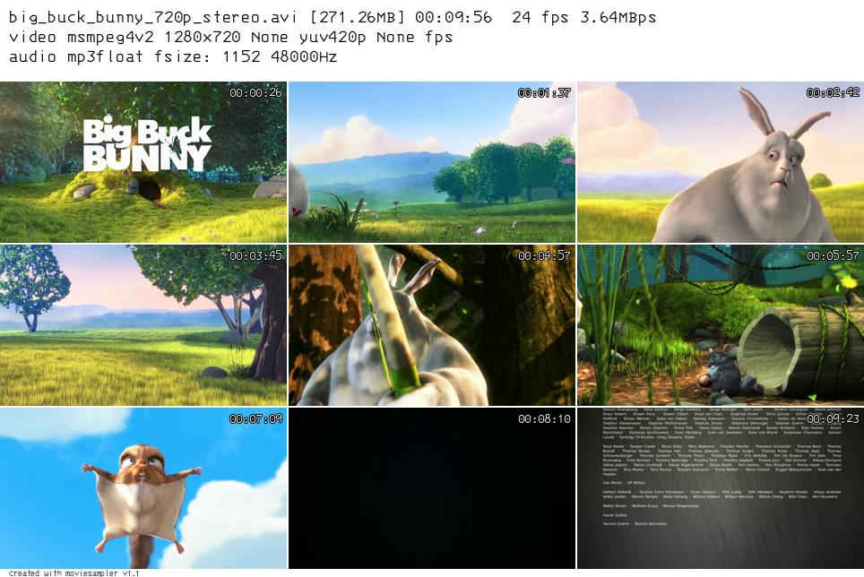

# MovieSampler

Video file thumbnailer.

The following command line:

    moviesampler -g 3x3 -o img big_buck_bunny_720p_stereo.avi

Produces the image:

## Usage

Use the command `moviesampler --help` to see the options

## License

This project is released under the MIT License

